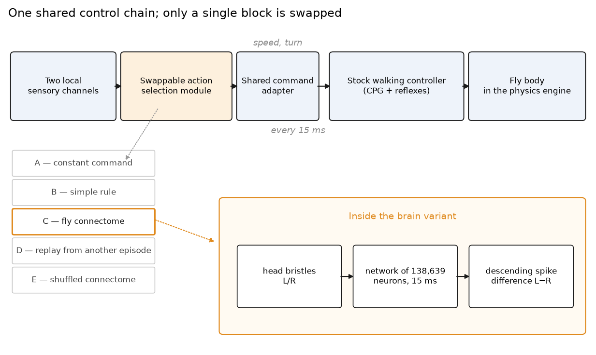
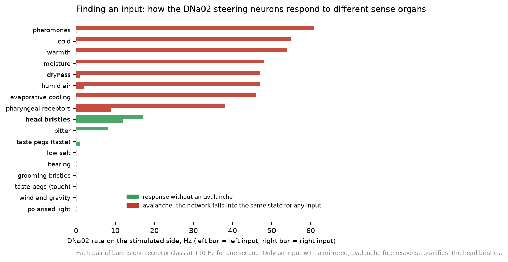
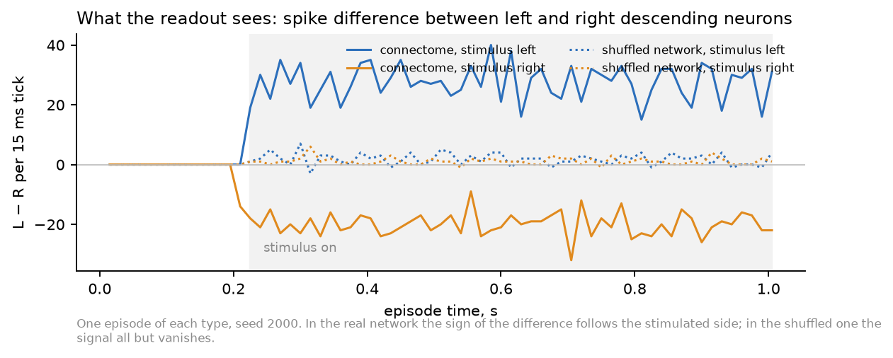
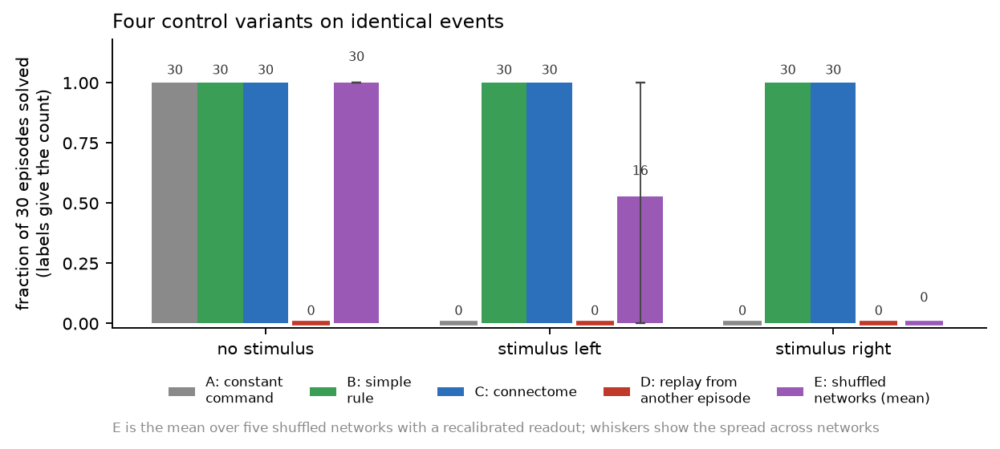
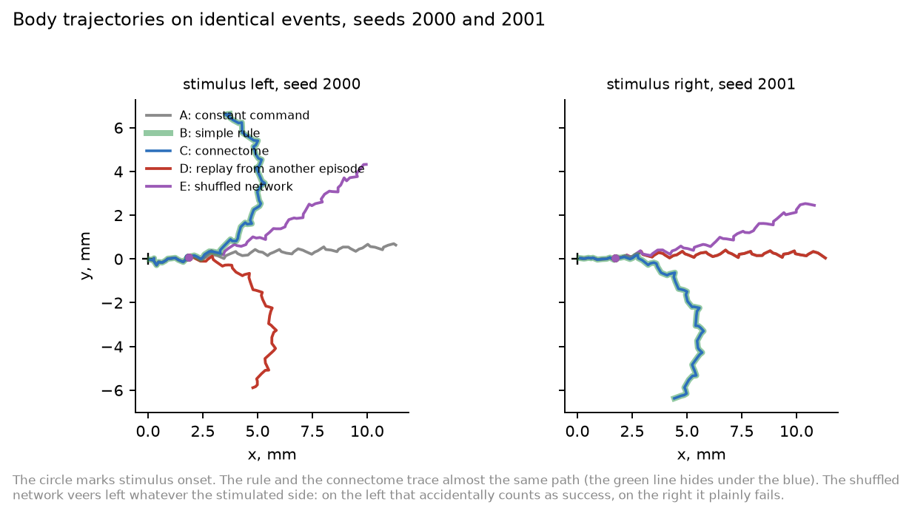
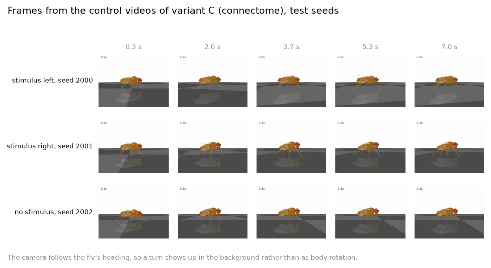

# What a fly connectome adds to controlling a body

A reproducible experiment on the NeuroMechFly body model and the complete wiring map of the *Drosophila* brain.

**In brief.** We took a physics model of a fly with a real six-legged body, and the complete wiring map of the *Drosophila* brain — 138,639 neurons and 15,091,983 connections reconstructed from electron microscopy. We harnessed them together and asked a narrow question: what exactly does the brain contribute, when the body and the low-level walking controller are identical across all variants?

The answer came in three parts. A convincing gait owes the brain nothing: the stock motor controller produces it. The network's live response to the current situation is necessary — replace the brain's output with a recording from a different episode and behaviour collapses completely. The structure of the connections matters too: five networks in which we reshuffled the wiring while preserving every vertex degree and every weight lose the ability to tell which side was touched. Yet on our tasks the connectome showed no advantage whatsoever over a controller two lines long — both solve them perfectly.

The full write-up is in [`paper/fly-lab-en.pdf`](paper/fly-lab-en.pdf) (Russian: [`paper/fly-lab-ru.pdf`](paper/fly-lab-ru.pdf)). This README reproduces the report and then explains, in detail, how to run everything again.

| | A: constant command | B: two-line rule | C: connectome | D: replay | E: shuffled |
|---|---:|---:|---:|---:|---:|
| No stimulus: no false command | 30/30 | 30/30 | **30/30** | 0/30 | 30/30 |
| Stimulus left: turn left | 0/30 | 30/30 | **30/30** | 0/30 | 0–30 |
| Stimulus right: turn right | 0/30 | 30/30 | **30/30** | 0/30 | 0/30 |

---

## Why bother

In the autumn of 2026 it became fashionable again to say that a fruit fly's brain has been "uploaded" into a computer and is now driving a virtual body. The videos are persuasive: the fly steps briskly, turns, stops. The trouble is that a video cannot tell you who is actually doing the driving.

Any such assembly contains two independent mechanisms. The first is the low-level walking controller: a set of coupled oscillators and reflexes that knows how to place six legs in the right order, catch its balance and keep the fly upright. It was written by people, tuned on real gait recordings, and works entirely on its own, with no brain attached. The second is the connectome network proper, which is supposed to decide *where* and *when* to go. The beauty of the gait in a video is almost entirely the achievement of the first. Establishing what the second adds takes a separate and rather tedious experiment.

We ran that experiment. One caveat up front: this is a test of our own implementation of a similar architecture, not a reproduction of anyone's particular system. We had no access to their source code, parameters or hand-made neuron mappings, and negative results here cannot be transferred to other people's builds.

We split the vague question "does the fly brain work" into three sharp ones:

- **Can the body walk convincingly with no connectome at all?**
- **Is the network's ongoing activity needed to choose actions?** That is, does it matter that the network responds to what is happening right now — or would any signal of a similar shape do?
- **Does the biological structure of the connections confer an advantage?** Or would a random network of the same size, and a simple rule, do just as well?

## What it is built from

The body is NeuroMechFly, a detailed physical model of *Drosophila*: segmented legs, joints with realistic limits, tarsal contact with the ground, adhesive footpads. We used it through the FlyGym library version 1.3.2 (the older interface, for which detailed controller examples exist) and did not change a single line of the walking controller itself. The physics timestep is 0.1 ms.

The brain is the model of Philip Shiu and colleagues: each neuron is described by a simple leaky integrate-and-fire equation, and the connections between neurons come from the FlyWire map, data version 783. That is 138,639 neurons and 15,091,983 directed connections, totalling 54 million synapses. We verified the whole table: the correspondence between indices and identifiers, and the finiteness and correctness of every weight.

We first satisfied ourselves that both halves work on their own. The library's own turning test passed without complaint. We reproduced the brain model on the authors' original example: sugar taste delivered to sensory neurons, thirty repetitions, response of the proboscis motor neuron averaging 82.9 Hz. One further check turned out to matter for everything that followed: we ran the network once continuously for 1,005 milliseconds and once as 67 segments of 15 milliseconds, and confirmed that spikes, potentials and synaptic states matched bit for bit. This means the network can be halted every 15 ms, asked for its opinion, and resumed, without breaking anything.

## How the experiment is arranged



A fair comparison is possible only when exactly one detail differs between variants. So we built a shared chain: two local sensory channels → swappable action-selection module → shared command adapter → stock walking controller → body. The adapter takes two dimensionless quantities, speed and turn, and converts them into two descending drives for the controller. The command is refreshed every 15 milliseconds, during which the physics engine takes 150 steps. Vision is disabled in all variants, and the body is created afresh for every episode.

There are five swappable modules:

- **A — constant command.** Walk forward, never turn. Shows how much of the persuasiveness comes from the walking controller alone.
- **B — simple rule.** Two lines: if the left sensor fires, turn left; if the right one fires, turn right. No memory.
- **C — connectome.** The sensory channels drive excitation of real fly sensory neurons, the network computes, and the command is read out of descending-neuron activity.
- **D — feedback broken.** The same network, but its output is replaced by a recording from a different episode with different events. The temporal structure is preserved; the link to the current situation is severed.
- **E — shuffled connectome.** Five networks whose connections have been permuted at random while preserving every vertex degree and every weight.

The tasks are deliberately short and simple. An episode lasts one second; at a moment unpredictable to the controller, between 180 and 300 milliseconds, a stimulus appears — on the left, on the right, or nowhere. Success for a turn means a heading change greater than 0.2 radians in the correct direction within half a second of onset; success for the background condition means no false command. Stopping was tested separately with a three-second horizon.

All parameters, thresholds and success criteria were written down before we looked at any test outcome — see [`docs/protocol.md`](docs/protocol.md). Calibration seeds (1000–1009) and test seeds (2000–2029) were separated in advance; events are produced by their own random number generator, so variants cannot shift them by consuming randomness differently. That the event files match within each compared pair is verified by checksum.

## What the body can do without a brain

A great deal. The constant "walk straight" command produces a stable gait: the fly covers 13.4 mm in a second and never flips. A prescribed turn works in both directions: an asymmetric command yields a heading change of 2.9 radians to the left or 2.6 to the right in the same second. A zero command drops the speed from 15 mm/s to almost nothing.

In other words, everything that impresses in a video — the rhythmic stepping, the stability, the smooth turns — is available without a single neuron from the connectome. This is no criticism of either the model or the connectome: it is by design, and in insects walking really is governed largely by rhythm generators in the ventral nerve cord rather than by the brain. But it does mean that the brain's contribution cannot be judged from how good the gait looks.

Rule B was flawless on the same turning tasks: 30 successes out of 30 in each direction, against zero for the constant command. Strict stopping, however — holding the speed below 1 mm/s for 150 milliseconds — it managed only 13 times out of 30. Choosing the "stop" command correctly and physically braking a six-legged body are different achievements.

> **On one error we caught.** The first version of the stopping criterion required ten consecutive samples 15 ms apart, which in fact spans 135 milliseconds rather than 150. We found the mistake in the calibration data before looking at the test outcomes, corrected it to eleven samples and re-evaluated; the rule's calibration success fell from 9 out of 10 to 4 out of 10. We mention it because arithmetic of this kind is the commonest way to obtain the result one was hoping for without noticing.

## Finding where to plug the brain in

The hardest part of the experiment is not running the network but honestly locating its input and its output. One must not stimulate the output neurons with a "turn left" command computed by one's own code: then the code makes the decision and the brain is left to forward the memo ceremonially.

The obvious first attempt was to take the sugar receptors, as in the original example, and read the steering neurons DNa01 and DNa02, which the literature describes as involved in heading control. It failed, and instructively so. The left set of sugar receptors evoked a response in the proboscis motor neuron but not a single spike in the steering neurons. The right set did produce spikes — and we very nearly accepted that as a working pathway.

A thorough check saved us. We ran seventeen receptor classes on both sides and discovered a general property of the model: given enough excitation, the network collapses into one and the same state — some 8,400 active neurons, half a million spikes per second — regardless of which sense organ we stimulated. Three input neurons suffice. The "response" of the right-hand sugar receptors was exactly such an avalanche rather than a taste-to-turn pathway; the asymmetry within the avalanche belongs to the network, not to the stimulus. The full screen is in [`docs/sensory-screen.md`](docs/sensory-screen.md).



That is how we found the working input: the bristles on the fly's head, 150 cells on the left and 155 on the right. Biologically this makes sense — a touch to the head bristles is naturally associated with avoidance and turning, and DNa02 is described in the literature as steering the fly towards its own side. We used that correspondence as a hint about where to look, but verified it with our own measurements rather than with a citation.

It also turned out that individual DNa02 neurons fire too rarely to be useful: two to four spikes over 300 milliseconds of stimulation, which means almost always zero within a 15 ms tick. So we built the readout on the whole descending population: 645 neurons on the left and 646 on the right. The difference in their spike counts per tick proved a fast and reliable indicator of side — the first spike appears four milliseconds after onset, and the sign of the difference never once confused the sides.



The readout rule itself — a running average of the difference, a threshold and a scale — was chosen by a small grid search on calibration seeds only. The criterion was per-tick agreement with the decisions of simple rule B; eight of thirty-two combinations agreed perfectly, and we took the simplest of them. After that the parameters were never touched again.

## Results



For E the range across the five shuffled networks is given, after the permitted readout recalibration. The C − B difference is zero in all three tasks with a conservative confidence interval of ±13.6 percentage points; this is not proof of equivalence, since the interval is wider than the 5-point margin declared in advance.

### The connectome solves the tasks exactly as well as a two-line rule

The connected brain handled both sides perfectly: 30 out of 30 to the left, 30 out of 30 to the right, and no false command without a stimulus. The reaction begins in the very tick the stimulus switches on, and the heading change over half a second ranges from 1.15 to 1.52 radians.

Rule B gives precisely the same result. This is an honest zero difference, not a victory for the connectome. The reason is transparent: the task is too easy. When the correct answer is "turn towards whatever is happening", one bit of information suffices, and any mechanism that delivers that bit will score a hundred per cent. On such a task the difference between a sophisticated and a trivial solver is not measurable in principle.



### The network's live response is necessary

Variant D answers the second question unambiguously. We took the network's output from a different episode of the same seed — a signal with the same statistics, the same temporal structure and the same characteristic rates, but generated by different events — and passed it through the very same readout. Not one of ninety episodes succeeded. With no stimulus the recording produces false turns; with a stimulus on either side the fly turns the wrong way or does not turn at all.

This means that variant C's success rests on the network responding to the current situation, not on its output having a convenient shape. The caveat is obligatory: the claim concerns our assembly and our way of wiring it, not the biology of the fly.

### The structure of the connections matters

Variant E answers the third question. We built five networks in which all fifteen million connections were re-drawn, under strict constraints: each neuron keeps its number of incoming and outgoing connections separately for excitatory and inhibitory synapses, the entire multiset of weights is preserved, and there are no self-loops or duplicates. A hundred per cent of the "from → to" pairs changed. The input and output neurons are the same ones.

The shuffled networks are neither silent nor saturated: they answer a stimulus with thirty thousand spikes against the original's forty thousand. But almost nothing reaches the descending neurons — instead of 74–122 spikes per tick there remain between 0.4 and 6.6 — and the difference between the left and right populations falls from twenty or thirty spikes to one or two, with its sign no longer depending on which side was stimulated.

In behaviour this looks as follows. With no stimulus all five networks behave impeccably (they have nothing to err with, being silent); with a stimulus on the right all five fail completely; with a stimulus on the left three networks of five accumulate successes. Inspection shows these are not responses: those networks carry a weak constant leftward bias that pushes the fly the same way whatever the stimulated side; on the left that happens to satisfy the criterion, on the right it plainly does not. The permitted recalibration of the readout adds successes on the left, but it cannot create a dependence of sign on the side of the input.

In summary, the "shuffled minus original" difference is −69 percentage points with the original readout and −47 after recalibration for a left stimulus, and −100 points for a right stimulus. A hierarchical bootstrap that resamples networks first and episodes within networks second gives intervals that do not cross zero.



## What follows, and what does not

Three questions received three different answers, and they must not be conflated.

The body walks, turns and brakes without a connectome. That is a property of the motor controller, not evidence that a brain is unnecessary: in a living fly it does not set the step rhythm either.

The network's ongoing activity is necessary for action selection in our assembly — substituting a recording from another episode destroys the result entirely. That is an answer about feedback, not about the model's biological fidelity.

The structure of the connections matters for this wiring: a shuffle that preserves every degree and every weight breaks the transmission of the signal to the descending neurons. It does *not* follow that the original network performs a sophisticated computation. The task on which we showed this is linearly simple: the side of the input determines the side of the output. We demonstrated the survival of a lateralised pathway in the real topology and its absence in the shuffled one — no more than that.

And the principal negative result: **on these tasks the connectome showed no advantage over a two-line controller.** Both score thirty out of thirty. The five-percentage-point margin of practical equivalence we declared in advance is unreachable with thirty seeds — the interval comes out wider — so equivalence cannot be claimed as proven either. The task is simply too easy to separate the contestants.

## What we did not do

The scenarios stayed the simplest possible: short episodes with a stimulus that switches on and never off. We did not test stimulus disappearance, changes in intensity and duration, conflict between inputs, noise and dropouts, navigation towards a target, new starting positions, uneven terrain or perturbations. Those are exactly the conditions under which a simple rule and a connectome might part ways, and they are the obvious continuation.

Stopping remains blocked for the brain variants: we have no validated neural output corresponding to speed. The sugar input to the proboscis motor neuron remains a hypothesis, and declaring it a "stop neuron" for the sake of a tidier table would have been fitting the result.

In the present scenarios the brain pass is computed separately from the body. For external stimuli that do not depend on movement this is strictly equivalent to interleaving — we verified it, and the agreement is bit-exact. Scenarios with contact feedback will require a genuine joint loop.

Finally, we did not build a neural-network controller as a separate contestant, did not implement feeding or grooming, and did not enable vision. All of this is recorded in the protocol as a second stage. A separate side experiment, using the connectome as a fixed reservoir for Boolean satisfiability, will be published here later.

---

# Reproducing this

Everything below was run on macOS 26.6 on an Apple M5 with 10 cores and 32 GB of unified memory. Both the brain and the physics ran on the CPU; no GPU was used. Total compute: 1,464 body episodes (21.3 hours of processor time) and 724 brain passes (4.1 hours).

## 1. Sources and environments

The brain and the body need incompatible Python versions, so they live in two separate virtual environments. Third-party sources are pinned by commit hash and are not vendored in this repository.

```sh
git clone https://github.com/philshiu/Drosophila_brain_model.git vendor/Drosophila_brain_model
git -C vendor/Drosophila_brain_model checkout 91bdd1e7dcf193f3e7ca5a8933497fcef63b7960

git clone https://github.com/NeLy-EPFL/flygym-gymnasium.git vendor/flygym-gymnasium
git -C vendor/flygym-gymnasium checkout d285260a1c8a7b3494150cd1590f2c9fe4b5e06b

git clone https://github.com/flyconnectome/flywire_annotations.git vendor/flywire_annotations
git -C vendor/flywire_annotations checkout 8587524c1748ce5ef2080822a2fc890fc03bf597

uv venv --python 3.10.21 .venv-brain
uv pip install --python .venv-brain/bin/python -r requirements/brain.txt

uv venv --python 3.12.14 .venv-body
uv pip install --python .venv-body/bin/python -r requirements/body.txt -e vendor/flygym-gymnasium
```

The connectome tables (`Completeness_783.csv`, `Connectivity_783.parquet` and the 630 versions used for the original example) come with the brain-model repository. Their SHA-256 sums, together with the versions of every installed package, are recorded in `results/manifest-example-body.json` and `results/manifest-example-brain.json`; each run in the original data set carried its own copy of that manifest.

Run commands one at a time and check the exit code. Each run writes into a new directory under `results/` and refuses to overwrite an existing one, so nothing can silently clobber earlier data.

## 2. Independent checks of the two halves

```sh
.venv-body/bin/python -m pytest -q vendor/flygym-gymnasium/flygym_gymnasium/examples/locomotion/tests/test_hybrid_turning.py::test_turning
.venv-body/bin/python experiment.py body --label body-straight-0 --seconds 1.005
.venv-body/bin/python experiment.py body --label body-left-0   --command left  --seconds 1.005
.venv-body/bin/python experiment.py body --label body-right-0  --command right --seconds 1.005
.venv-body/bin/python experiment.py body --label body-stop-0   --command stop  --seconds 3

.venv-brain/bin/python experiment.py brain --label sugar-reference-30 --trials 30
.venv-brain/bin/python brain_probe.py stream --label brain-stream-0
```

`experiment.py brain` reproduces the upstream `run_trial` on the v630 data: the sugar-responsive neurons from the authors' notebook, one second, the original equations and Poisson inputs. `brain_probe.py stream` is the check that matters most: it runs the same network once for 1,005 ms and once as 67 slices of 15 ms and asserts that spike indices, spike times, membrane potentials and synaptic states are identical.

## 3. Searching for a usable input

```sh
.venv-brain/bin/python brain_probe.py audit --label brain783-audit-0

.venv-brain/bin/python brain_probe.py sensory783 --label screen783-mechanosensory-head-bristle-left-150 \
    --side left --cell-class mechanosensory --sub-class 'head bristle' --hz 150

.venv-brain/bin/python results/screen783-run.py 1 results/screen783-jobs.txt
.venv-brain/bin/python screen_analysis.py screen783-
```

`brain_probe.py sensory783` selects input neurons from the official FlyWire annotations by `cell_class`, `cell_sub_class` and nerve-entry side, drives them with the model's own Poisson inputs and records the response of the four DNa neurons, of MN9 and of the whole network. `--allow-missing` drops annotated identifiers that are absent from the model's completeness table and writes them to `excluded_ids.json`; without the flag the run refuses to proceed, so nothing is quietly excluded.

`results/screen783-jobs.txt` holds the full list of screen commands; `results/screen783-run.py N FILE` runs them with N workers, skips labels that already have a `summary.json` and deletes half-written directories. Two workers is the safe maximum: three concurrent Brian2 networks exceeded the available memory on a 32 GB machine.

Pulse probes, which switch the stimulus on for 300 ms in the middle of a 900 ms run and record per-tick spike counts:

```sh
.venv-brain/bin/python brain_probe.py pulse783 --label screen783-pulse-head-bristle-left \
    --side left --cell-class mechanosensory --sub-class 'head bristle' --hz 150
```

## 4. The A/B pilot

```sh
.venv-body/bin/python pilot.py check          # self-checks of the policies, the metric and the intervals
.venv-body/bin/python test_pilot.py           # regression check of the stop-window arithmetic

.venv-body/bin/python pilot.py calibration --tag ab-calibration-v1 --workers 4
.venv-body/bin/python pilot.py test --tag ab-test-v1 --workers 4 --scenarios none left right
.venv-body/bin/python pilot.py test --tag ab-test-stop-v2 --workers 4 --scenarios stop
```

`pilot.py analyse --tag NAME` re-evaluates a stored series with the corrected stop metric and writes the result into a `metric-v2/` subdirectory; it refuses to overwrite an existing evaluation.

## 5. Brain passes, readout calibration, and variants C, D, E

The brain pass for an episode is computed by `brain_loop.py`, which drives the head-bristle inputs from the same event stream the body will see, advances the network in 15 ms ticks and records, for every tick, the number of new spikes in the left and right descending populations.

```sh
.venv-brain/bin/python brain_loop.py --check        # shuffle invariants on a synthetic graph
.venv-brain/bin/python brain_loop.py --label c-brain-cal-v1-left-1000 --scenario left --seed 1000

.venv-brain/bin/python results/screen783-run.py 2 results/c-brain-cal-v1-jobs.txt   # 30 calibration passes
.venv-brain/bin/python results/screen783-run.py 2 results/c-brain-test-v1-jobs.txt  # 90 test passes
```

Then the readout is chosen on calibration data only, the body is calibrated, and the test is run paired against the already-recorded A and B episodes:

```sh
.venv-body/bin/python pilot.py calibrate-readout --brain-tag c-brain-cal-v1

.venv-body/bin/python pilot.py calibration --tag c-cal-v1 --workers 2 \
    --scenarios none left right --policies C \
    --brain-tag c-brain-cal-v1 --readout results/c-brain-cal-v1-readout.json

.venv-body/bin/python pilot.py test --tag cd-test-v1 --workers 2 \
    --scenarios none left right --policies C D \
    --brain-tag c-brain-test-v1 --readout results/c-brain-cal-v1-readout.json

.venv-body/bin/python pilot.py compare --tag cd-test-v1 --against ab-test-v1 --pair C A
.venv-body/bin/python pilot.py compare --tag cd-test-v1 --against ab-test-v1 --pair C B
```

An interrupted series can be continued with the same command plus `--resume`: recorded episodes are kept and directories of episodes that were cut off mid-run are removed.

For variant E, the shuffled connectivity matrices are generated once per seed and cached, then the same brain passes and body tests are run against them:

```sh
.venv-brain/bin/python brain_loop.py --make-shuffled 4000 4001 4002 4003 4004
.venv-brain/bin/python results/screen783-run.py 2 results/e-brain-v1-jobs.txt   # 600 passes, several hours

.venv-body/bin/python pilot.py calibrate-readout --brain-tag e-brain-cal-v1-s4000   # and for 4001…4004
results/e-body-run.sh 4000 4001 4002 4003 4004                                      # fixed and recalibrated readout

.venv-body/bin/python pilot.py compare-networks --tag e-compare-fixed-v1 --against cd-test-v1 --pair E C \
    --network-tags e-test-v1-s4000 e-test-v1-s4001 e-test-v1-s4002 e-test-v1-s4003 e-test-v1-s4004
.venv-body/bin/python pilot.py compare-networks --tag e-compare-recal-v1 --against cd-test-v1 --pair E C \
    --network-tags e-recal-test-v1-s4000 e-recal-test-v1-s4001 e-recal-test-v1-s4002 e-recal-test-v1-s4003 e-recal-test-v1-s4004
```

Videos are recorded separately, on seeds chosen in advance, and their trajectories are compared byte for byte with the measurement runs:

```sh
.venv-body/bin/python results/screen783-run.py 1 results/video-C-jobs.txt
```

## 6. Rebuilding the figures and the report

```sh
.venv-body/bin/python paper/figures.py
cd paper && weasyprint fly-lab-en.html fly-lab-en.pdf && weasyprint fly-lab-ru.html fly-lab-ru.pdf
```

`paper/figures.py` reads only from `results/` and writes the seven PNG files used by the report in both languages.

## Where to look in the results

| Path | What is in it |
|---|---|
| `results/ab-test-v1/summary.json` | A vs B on the turning tasks, with paired intervals |
| `results/ab-test-stop-v2/metric-v2/summary.json` | the stopping task under the corrected metric |
| `results/cd-test-v1/summary.json` | C vs D, and the per-episode record in `episodes.json` |
| `results/cd-test-v1/compare-C-vs-A-ab-test-v1/` | C against A on identical events |
| `results/cd-test-v1/compare-C-vs-B-ab-test-v1/` | C against B on identical events |
| `results/e-compare-fixed-v1/summary.json` | five shuffled networks against C, original readout |
| `results/e-compare-recal-v1/summary.json` | the same after the permitted recalibration |
| `results/c-brain-cal-v1-readout.json` | the readout grid search and the parameters chosen |
| `results/brain-body-gate-v2.json` | machine-readable statement of what the brain variants were admitted to |
| `results/screen783-analysis/` | the sensory screen: per-run table and lateralisation index |
| `results/e-brain-v1-summary.json` | activity and lateralisation of the shuffled networks |
| `results/cd-secondary-metrics.json` | latency, saturation, DNa02 rates, wall time and memory for C |
| `results/<episode>/trajectory.csv` | per-tick position, speed, heading and commands for one episode |
| `results/<pass>/brain_ticks.json` | per-tick descending spike counts for one brain pass |

Every episode directory also holds the exact event file it ran on, so any comparison can be re-checked independently.

## Documentation

- [`docs/protocol.md`](docs/protocol.md) — the protocol as it was fixed before the test, including the exact wiring of C, D and E, and the history of corrections.
- [`docs/sensory-screen.md`](docs/sensory-screen.md) — the search for a usable input, the avalanche, and the pulse measurements.
- [`docs/neuron-ids.md`](docs/neuron-ids.md) — neuron identifiers, their sources, and the version discrepancies we found.
- [`docs/reproducing.md`](docs/reproducing.md) — a condensed command reference.

## How this was made

The questions, the framing and every decision about what counts as evidence are the work of one person, Recluse, who also insisted on the discipline that shaped the result: separate the calibration data from the test data, write the criteria down before looking at the outcomes, and treat a plausible-looking response as a hypothesis until it survives a control.

The construction was done with two AI assistants over several sessions. The first assembly — the two isolated environments, the body harness, the A/B pilot and the initial documentation — was written with OpenAI Codex. The work reported here — the search for a usable sensory input, the wiring of the brain into the loop, variants C, D and E, the statistics, the figures and the text of this report — was written with Anthropic's Claude. Both assistants wrote code and prose; neither was allowed to choose a criterion after seeing a result.

We name them because it is honest and because it is relevant to how the reader should treat this document, not as a credit. Language models are not authors: an author has to be answerable for the work, and a model cannot be. What a model can do is make a mistake that reads well, which is exactly the failure mode this project kept running into. Two of them are described in the report — the stop-window arithmetic that quietly shortened the measurement interval, and the network avalanche that looked like a working sensory pathway for a whole round of the experiment. Both were caught by controls rather than by reading the code.

That is the practical reason every number here is traceable to a file. Do not take the prose on trust: the measurements are in `results/`, the criteria are in `docs/protocol.md` with the date at which each was fixed, and the commands that produce them are above.

## Licence

Code is MIT ([`LICENSE`](LICENSE)). Data, figures and text are CC BY 4.0 ([`LICENSE-DATA`](LICENSE-DATA)). Third-party components — the brain model, the body model and the FlyWire annotations — keep their own licences and are not redistributed here.
