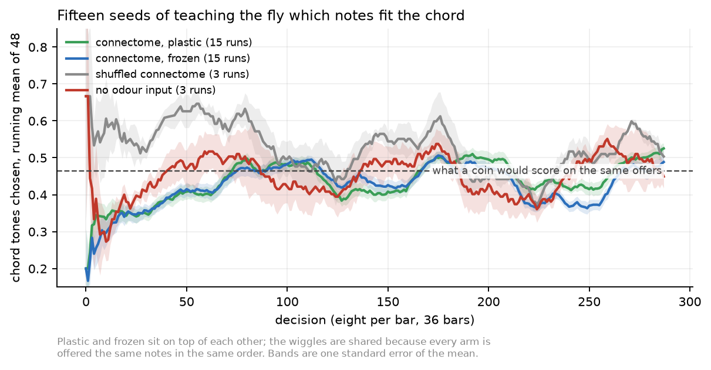

# Teaching the fly which notes to play

The other half of the side experiment that produced [`criticality.md`](criticality.md). The
question a reader asked: can the fly be rewarded when it hits a note that fits the chord, and
does it then hit more of them?

**The short answer: no, or at any rate not measurably.** On three seeds the network with
dopamine-gated plasticity chose more chord tones than the same network with its synapses
frozen, by about four notes in a hundred. Twelve further seeds, run blind, cut that to
**+0.005, with a 95 per cent interval of [−0.015, +0.026]** — a confidence interval comfortably
wrapped around zero, and six of the twelve seeds pointing the wrong way. The first three seeds
were the ones watched while the experiment was being built, and they came out third, fourth and
fifth largest of the fifteen. That is what selection looks like from the inside, and it is the
main thing this page records.

## What learns, and what does not

Only one bundle of synapses changes: the 62,261 connections from Kenyon cells to mushroom body
output neurons, four tenths of one per cent of the model's 15,091,983. Everything else keeps
the weights the connectome gives it.

The rule is the one the animal is thought to use — depression gated by dopamine, never
potentiation, with slow recovery towards the original weight:

- a candidate note is presented as an odour (one olfactory receptor class per scale degree);
- the fly's answer is the difference in spikes between two disjoint halves of the descending
  population, and the candidate with the highest answer is played;
- if the played note is a chord tone, the appetitive dopaminergic cluster PAM is driven;
  otherwise the aversive cluster PPL1 is;
- the Kenyon-cell synapses that fired during the chosen candidate, onto the half of the output
  neurons that argued for it, are depressed by 20 per cent; all plastic synapses relax 2 per
  cent of the way back to their connectome value at every step.

The decision is read from the descending neurons rather than from the mushroom body output
because in the working regime only two to five output neurons fire per window, while the
descending population fires hundreds of times — and the mushroom body reaches it directly
(361 contacts onto 160 descending cells).

## Arms and controls

All four arms share the same network seed, the same sequence of offered scale degrees and, as
it turned out, the same stream of Poisson noise: the network is built once per run with a
fixed seed and every arm makes the same number of simulation calls of the same length. That is
common random numbers, and it is why the paired differences are steadier than the runs
themselves — the comparison is far more sensitive than either arm's absolute score.

| arm | what changes | seeds |
|---|---|---:|
| connectome, plastic | the experiment | 15 |
| connectome, frozen | identical, including the dopamine stimulation, but weights never change | 15 |
| shuffled connectome, plastic | degree-preserving shuffle; the odour barely reaches the mushroom body | 3 |
| no odour input, plastic | the candidate is never presented; the fly chooses among equal answers | 3 |

The two broken arms were left at three seeds. They were there to catch a policy that scores
without knowing anything — which is exactly what they did catch, once — and not to be measured
against; nothing below rests on them.

## Results

288 decisions per run.

| arm | chord tones chosen | what a coin would score | first quarter | last quarter |
|---|---:|---:|---:|---:|
| connectome, plastic | 0.455 | 0.464 | 0.420 | 0.508 |
| connectome, frozen | 0.444 | 0.465 | 0.419 | 0.474 |
| shuffled connectome | 0.522 | 0.475 | 0.565 | 0.537 |
| no odour input | 0.453 | 0.460 | 0.458 | 0.481 |

Paired, plastic minus frozen, over the whole run:

| seeds | difference | 95% interval |
|---|---:|---|
| all fifteen | +0.012 | [−0.005, +0.029] |
| **the twelve blind ones** | **+0.005** | **[−0.015, +0.026]** |
| the three watched during tuning | +0.037 | [+0.023, +0.051] |

Per seed, in the order they were run: 7002 +0.042, 7003 +0.031, 7004 +0.038 | 7005 −0.014,
7006 −0.021, 7007 +0.045, 7008 +0.073, 7009 −0.035, 7010 +0.007, 7011 +0.024, 7012 −0.003,
7013 +0.017, 7014 ±0.000, 7015 +0.007, 7016 −0.035. The three on the left are the watched ones.

Restricted to the last quarter, where a learning effect ought to be largest, the paired
difference is +0.036 [+0.004, +0.068] over all fifteen seeds and +0.023 [−0.013, +0.058] over
the blind twelve. The first of those two excludes zero and the second does not, and the only
difference between them is the three seeds that were looked at during development — which is
precisely why the honest number is the second one.



What is left that is not zero: both intact arms climb during a run, from about 0.42 in the
first quarter to 0.47–0.51 in the last, and the two broken arms do not. The climb is not the
plasticity — the frozen arm climbs too, and the paired difference of the climbs is +0.032
[−0.033, +0.098] — so if it is anything it is the dopaminergic stimulation itself dragging the
network around, which both arms receive. With three seeds on the broken arms even that is a
hint rather than a finding.

## What the twelve blind seeds cost, and why they were worth it

Three seeds gave +0.042, +0.031, +0.038: the same sign, nearly the same size, an interval
excluding zero, and a tidy story about dopamine teaching a fly the blues. Twelve more seeds,
run without looking at them, took the estimate to a fifth of that and put zero in the middle of
the interval. Nothing was wrong with the three runs; they were simply the three that were in
front of me while I was fixing the tie-break, choosing the stimulation length and picking the
readout, and choices made while watching a number tend to flatter it.

The other defect, found earlier and kept here because it is the more instructive one: in the
first campaign the winner among equal answers was chosen by `argmax`, which returns the first.
The candidates were sorted, so with the input switched off the policy always played the lowest
degree offered — the root of the scale, a chord tone in eight bars of twelve. The deaf control
scored 0.503 that way, above the coin, while knowing nothing. It is the same failure as the
"always flip" policy in the SAT experiment, caught this time by a control rather than by luck.
Ties are now broken at random; the first campaign's four runs are kept in `results/music-v1-*`
as the record.

Neither of those is an argument that the fly cannot be taught. What can be said from fifteen
seeds is narrower: with this reinforcement rule, this readout, this many decisions and this
network, any effect is smaller than about two and a half notes in a hundred, which is the top
of the interval. A real attempt would need a readout that discriminates better than the
descending split — the network's own inability to tell one odour from another,
[measured next door](criticality.md), is the obvious suspect — and not merely more seeds.

## Reproducing

```sh
.venv-brain/bin/python music_learn.py --label music-v2-learn-s7002 --bars 36 --candidates 3 \
    --eval-ms 200 --teach-ms 150 --hz 1200 --teach-hz 1200 --wsyn 0.12 --choice-seed 7002
.venv-brain/bin/python music_learn.py --label music-v2-frozen-s7002 ... --no-plasticity
.venv-brain/bin/python music_learn.py --label music-v2-shuffled-s7002 ... --shuffle-seed 4000
.venv-brain/bin/python music_learn.py --label music-v2-deaf-s7002 ... --deaf
.venv-body/bin/python music_analysis.py music-v2
.venv-body/bin/python paper/music_figures.py
```

One run is about 26 minutes on one core; two at a time is the limit on 32 GB. The four arms on
seeds 7002–7004 are `results/music-v2-jobs.txt`, the twelve blind seeds 7005–7016 on the two
main arms are `results/music-v3-jobs.txt`, both run with `results/screen783-run.py 2`.
`music_analysis.py` reports the blind subset separately; `BLIND_FROM` in that file is where the
line is drawn.
